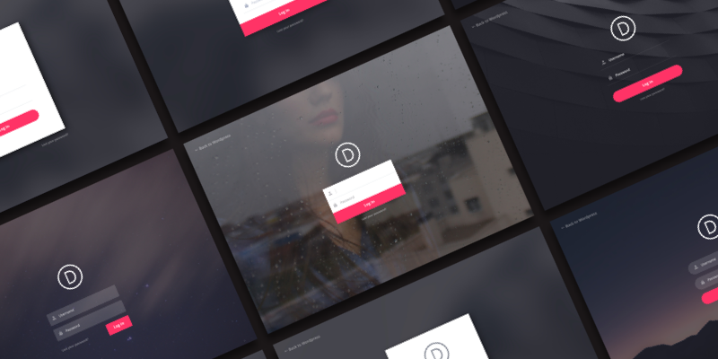

# Login Page


The **Divi 100 - Login Page Plugin** is made for Divi as apart of the [Divi 100 series](www.elegantthemes.com/blog/theme-sneak-peeks/the-divi-100-marathon-and-the-countdown-to-divi-3-0) by Elegant Themes. This plugin applies custom styles to your WordPress login page.

## What's Included
```
Divi-100-Login-Page
├── LICENSE
├── README.md
├── assets
│   ├── css
│   │   ├── ionicons.css
│   │   ├── ionicons.min.css
│   │   └── style.css
│   ├── fonts
│   │   ├── ionicons.eot
│   │   ├── ionicons.svg
│   │   ├── ionicons.ttf
│   │   └── ionicons.woff
│   ├── img
│   │   ├── logo-alt.svg
│   │   ├── logo.svg
│   │   └── preview
│   │       ├── style-1.gif
│   │       ├── style-2.gif
│   │       ├── style-3.gif
│   │       ├── style-4.gif
│   │       ├── style-5.gif
│   │       ├── style-6.gif
│   │       └── style-7.gif
│   └── js
│       └── scripts.js
├── divi-100-setup
│   ├── class-divi-100-settings.php
│   ├── class-divi-100-utils.php
│   ├── css
│   │   └── admin-style.css
│   ├── divi-100-setup.php
│   └── js
│       └── admin-scripts.js
├── login-page.php
└── preview.png

9 directories, 26 files
```

## Installation
1. You can download the latest release [here](https://github.com/andyhqtran/Divi-100-Login-Page/releases).
2. Once downloaded, head over the **Plugins** tab in your control panel and hit **Add New**
3. Activate the plugin.

**Optional**: You can change the style of the login page by heading over to the Divi 100 - Login Page control panel where you'll be greeted with a color picker.

## Bugs &amp; Questions
Found a bug or have a question? Please first read the [issue guidelines](https://github.com/andyhqtran/divi-100-login-page/blob/master/.github/ISSUE_TEMPLATE.md) and search for existing and closed issues. If your problem is not addressed yet, feel free to [open a new issue](https://github.com/andyhqtran/divi-100-login-page/issues).

When opening an issue, please make sure you assign the proper label. For example, if you had a question, you would assign the `QUESTION` label.

## Credits
- [Andy Tran](https://github.com/andyhqtran)
- [Fikri Rasyid](https://github.com/fikrirasyid)
- [Mario Maruffi](https://dribbble.com/MarioMaruffi)
- [Unsplash](https://unsplash.com/)

## License
Copyright © 2016 [Elegant Themes](http://elegantthemes.com). Code released undered the [GPL License](https://github.com/andyhqtran/divi-100-login-page/blob/master/LICENSE).

>    This program is free software: you can redistribute it and/or modify
>    it under the terms of the GNU General Public License as published by
>    the Free Software Foundation, either version 3 of the License, or
>    (at your option) any later version.

>    This program is distributed in the hope that it will be useful,
>    but WITHOUT ANY WARRANTY; without even the implied warranty of
>    MERCHANTABILITY or FITNESS FOR A PARTICULAR PURPOSE.  See the
>    GNU General Public License for more details.

>    You should have received a copy of the GNU General Public License
>    along with this program.  If not, see <http://www.gnu.org/licenses/>.